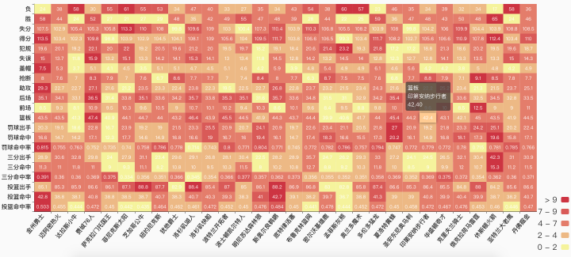

# NBA-visualization

> Font-end NBA data visualization project for 2018 Sichuan University data visulization course. 


## Description 

It only provides some Html/Javascript/css code. We don't plan to display the original data becasue it's so disorder.

Our data is from  [虎扑](www.hupu.com), [新浪NBA](http://sports.sina.com.cn/nba/), [某不知名网站](http://stat-nba.com/) and so on.


## Build Setup

``` bash
# clone the repository
git clone git@github.com:zyxnine9/nba-vis.git

# install dependency
npm install 

# serve with hot reload at localhost:8080
npm run dev

```


## Display 





